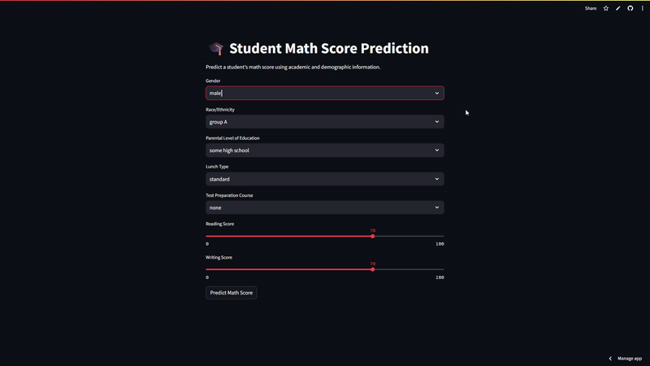

<p align="center">
  
</p>

[](https://student-score-prediction-ml-zfcmhmfohejlxjlfq5kq8y.streamlit.app/)

# 🎓 Student Score Prediction – Machine Learning Project

<p align="center">
  <a href="https://github.com/Alamin-refat/Student-Score-Prediction-ML">
    
  </a>
  <a href="https://github.com/Alamin-refat/Student-Score-Prediction-ML">
    
  </a>
  <a href="https://github.com/Alamin-refat/Student-Score-Prediction-ML/blob/main/LICENSE">
    
  </a>

  <br>

  
  
  
  
  

  <br>

  <a href="https://github.com/Alamin-refat/Student-Score-Prediction-ML/stargazers">
    
  </a>
  <a href="https://github.com/Alamin-refat/Student-Score-Prediction-ML/network/members">
    
  </a>
</p>

---

## 🎯 Project Overview
This project focuses on predicting a student’s **Math score** using factors such as reading score, writing score, gender, parental education, lunch type, and test preparation status.

The goal is to showcase a realistic, production-ready machine learning workflow rather than a simple notebook-based experiment.

---

## 🚀 Live Demo

- **Streamlit Cloud:** https://student-score-prediction-ml-zfcmhmfohejlxjlfq5kq8y.streamlit.app/  
- **Hugging Face Spaces:** https://huggingface.co/spaces/Alamin-refat/student-score-prediction

---

## ✨ Key Features

* **Lasso Regression:** Implements **L1 Regularization** to enhance model generalization and prevent overfitting.
* **Predictive Analytics:** Accurately predicts student scores based on providing data-driven academic insights.
* **Data Visualization:** Includes **EDA** with scatter plots and regression lines for clear data insights.
* **Performance Metrics:** Evaluated using **Mean Absolute Error (MAE)** to ensure prediction accuracy.
* **Streamlined Pipeline:** Efficient workflow covering data preprocessing, model training, and testing.

---

## 📊 Dataset

The dataset contains student performance records with the following attributes:

- Gender  
- Race/Ethnicity  
- Parental level of education  
- Lunch type  
- Test preparation course  
- Reading score  
- Writing score  
- Math score (target variable)

> **Note:** EDA was performed on all score variables, and **Math score** was selected as the final prediction target to ensure a leakage-free modeling pipeline.

---

## 🔍 Exploratory Data Analysis (EDA)

Key EDA steps included:

- Distribution analysis of student scores
- Outlier detection using box plots
- Numerical feature correlation analysis
- Categorical feature impact analysis
- Correlation heatmaps to identify relationships between scores

Insights from EDA guided feature selection and modeling decisions.

---

## 🧠 Technical Workflow

The project implements a systematic Machine Learning pipeline to ensure high-performance and reliable predictions.

| Stage | Process | Key Tools |
| :--- | :--- | :--- |
| **01. Data Acquisition** | Importing & cleaning student datasets | `Pandas` |
| **02. EDA** | Distribution analysis & outlier detection | `Seaborn`, `Matplotlib` |
| **03. Preprocessing** | Categorical encoding & Train-Test Split | `Scikit-Learn` |
| **04. Modeling** | Lasso Regression with L1 Regularization | `Scikit-Learn` |
| **05. Evaluation** | Performance tracking (MAE, R²) | `NumPy`, `Sklearn.metrics` |
| **06. Deployment** | Containerization & Cloud hosting | `Docker`, `Streamlit` |

---

### 🛠️ Step-by-Step Implementation

1. **📥 Data Acquisition**
   Integrated student performance datasets using `Pandas` for structured data handling and cleaning.

2. **🔍 Exploratory Data Analysis (EDA)**
   Leveraged `Matplotlib` and `Seaborn` to analyze score distributions, detect outliers via box plots, and identify linear relationships between reading, writing, and math scores.

3. **⚙️ Data Preprocessing**
   - Handled categorical encoding for features like Gender, Parental Education, and Lunch type.
   - Performed **Train-Test Split (80/20)** to ensure unbiased model validation and prevent data leakage.

4. **🤖 Model Training**
   Trained a **Lasso Regression** model. We utilized **L1 Regularization** to shrink less important coefficients, which helps in automatic feature selection and prevents overfitting.

5. **📊 Model Evaluation**
   - Verified performance using **MAE (~4.21)** and **R² Score (~0.88)**.
   - Conducted a comparative analysis against Ridge and Linear regression to ensure Lasso provided the most generalized fit.

6. **🚀 Deployment**
   Developed an interactive dashboard using **Streamlit** and containerized the application via **Docker** for seamless deployment on **Hugging Face Spaces** and **Streamlit Cloud**.

---

## 📊 Final Model Performance

| Metric | Value |
|------|------|
| MAE | ~4.21 |
| RMSE | ~5.39 |
| R² Score | ~0.88 |

The model explains approximately **88% of the variance** in student math scores.

---

## 🧪 Model Comparison & Selection

The following regression models were trained and evaluated:

- Linear Regression  
- Ridge Regression  
- Lasso Regression  
- Random Forest Regressor  

### ✅ Final Model Choice
**Lasso Regression** was selected due to:

- Strong generalization performance
- Built-in regularization
- Automatic feature selection
- High interpretability of coefficients

---

## 🔎 Feature Importance & Interpretation

Model coefficients were analyzed to interpret feature impact.

Key observations:

- Writing score and reading score are the strongest predictors
- Gender and lunch type have noticeable influence
- Parental education level contributes moderately
- The model remains interpretable and explainable

---

## 🛠️ Tech Stack & Tools

- Python  
- Pandas, NumPy  
- Scikit-learn  
- Matplotlib, Seaborn  
- Streamlit  
- Docker (for Hugging Face deployment)

---
## 📂 Project Structure

A detailed look at the repository's organization:

```text
Student-Score-Prediction-ML/
├── .devcontainer/                 # Development container configuration
├── .ipynb_checkpoints/           # Jupyter notebook checkpoints
├── Data/                         # Dataset directory
├── assets/                       # Images/GIFs for README
├── README.md                     # Main project documentation
├── Dockerfile                    # Docker configuration for deployment
├── app.py                        # Streamlit web application
├── requirements.txt              # Python dependencies
├── LICENSE                       # MIT License file
├── student_score_model.pkl       # Trained model (pickle file)
└── student_score_prediction.ipynb # Main Jupyter notebook with full ML pipeline
```
---
## 💻 Installation & Usage

Follow these steps to set up the project locally on your machine:

### 1. Clone the Repository
Open your terminal or command prompt and run:
```bash
git clone [https://github.com/Alamin-refat/Student-Score-Prediction-ML.git](https://github.com/Alamin-refat/Student-Score-Prediction-ML.git)
cd Student-Score-Prediction-ML
```
### 2. Create a Virtual Environment (Recommended)
This keeps the project dependencies isolated and prevents conflicts:
```bash
# For Windows
python -m venv venv
venv\Scripts\activate

# For Mac/Linux
python3 -m venv venv
source venv/bin/activate
```
### 3. Install Required Libraries
Install all necessary dependencies listed in the requirements file to ensure the environment is ready:
```bash
pip install -r requirements.txt
```
### 4. Run the Streamlit Dashboard
Launch the web application locally to interact with the Student Math Score prediction model:
```bash
streamlit run app.py
```
---

## 🌐 Deployment

The application is deployed on **two platforms**:

### 1️⃣ Streamlit Cloud
- Direct deployment using Streamlit
- Public live demo for real-time predictions

### 2️⃣ Hugging Face Spaces (Docker-based)
- Dockerized Streamlit application
- Demonstrates cross-platform deployment capability

During deployment, several real-world challenges were addressed:
- Python and library version mismatches
- Dependency installation failures
- Windows-to-Linux environment differences

---

## 🗺️ Future Roadmap

This project is in its initial phase, and I plan to scale it with the following enhancements:

### 🔹 Model & Data Enhancements
* **Advanced Algorithms:** Beyond Lasso, I aim to implement **ElasticNet**, **Ridge**, and **Ensemble Methods** (like Random Forest) to compare performance.
* **AutoML Integration:** Incorporate **PyCaret** or **Auto-Sklearn** to automate the model selection and hyperparameter tuning process.
* **Feature Engineering:** Add more variables such as *Previous Grades*, *Attendance Percentage*, and *Sleep Hours* to increase prediction precision.

### 🔹 Web & Deployment
* **Modern Frontend:** Transition from basic HTML to a reactive framework like **React.js** or **Streamlit** for a smoother user experience.
* **Database Integration:** Implement **SQLite** or **PostgreSQL** to store user inputs and predicted results for historical tracking.
* **Cloud Native:** Containerize the application using **Docker** and deploy it on **AWS/Azure** using a robust CI/CD pipeline.

### 🔹 Analytics & Monitoring
* **Live Dashboard:** Add an interactive dashboard using **Plotly** or **Dash** to visualize student progress and trends.
* **Drift Detection:** Implement model monitoring to detect "Data Drift" and trigger retraining when student performance patterns change.

---

## ⚖️ License

This project is licensed under the **MIT License** - see the [LICENSE](LICENSE) file for details.

### 📜 Summary of Permissions:
* ✅ **Commercial use:** You can use this software for commercial purposes.
* ✅ **Modification:** You can modify the code.
* ✅ **Distribution:** You can distribute the code to others.
* ✅ **Private use:** You can use it privately for your own projects.

---

## 📬 Contact & Connect

If you have any questions, feedback, or would like to discuss potential collaborations, feel free to reach out!

**Alamin Refat** *Aspiring Data Scientist & Machine Learning Enthusiast*

[](https://www.linkedin.com/in/alaminrefat/)
[](https://github.com/Alamin-refat)
[](mailto:alaminrefat2017@gmail.com) 

---
